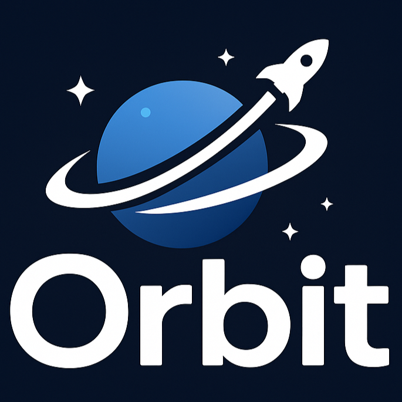
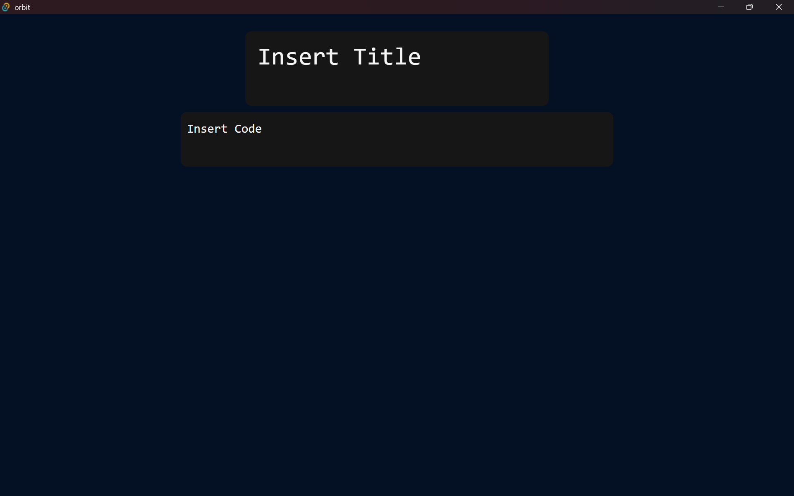

# Orbit Code Editor

Orbit is a lightweight, space-themed text editor designed to be simple yet visually appealing, featuring a dark cosmic aesthetic.

This project is fast, cross-platform, and resource-efficient. The goal of Orbit is to provide a clean, modern editor experience that feels sleek and minimal, while leaving room for future features like syntax highlighting, file management, and customization.

Design and features inspired by [Fextify](https://github.com/face-hh/fextify), made by [FaceDev](https://www.youtube.com/watch?v=iGsauIuaXXA).

## Roadmap

- File Management

- Editor Settings and Themes

- Keyboard Commands

- Syntax Highlighting, Autocomplete

- Fun twists

## Screenshots

